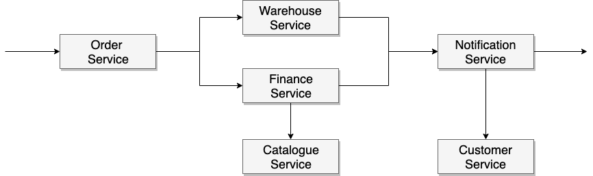

## Reactive microservice-based order management system

The project represents a collection of reactive backend services for placing an order through online webstore.

When create order request is sent to service-order, a number of microservices are ready to kick start upon receiving the corresponding events.

In the preceding diagram, there are six microservices shown:

- __service-order__: creates and updates orders.
- __service-warehouse__: reserves/releases stock for orders and creates shipment records.
- __service-payments__: processes payments and creates invoices.
- __service-catalogue__: contains product-related information (i.e. products, details, prices)
- __service-notification__: sends notifications to customers informing them about different order stages
- __service-customer__: contains customer-related information (i.e. name, contact infromation)

Each service is responsible for only one function and functions based on receiving and generatings events. 
Each service is independent and is not aware of its neighborhoods.

## Technologies

- Spring Webflux
- Spring RabbitMQ
- Spring Reactive Mongo
- MongoDB
- RabbitMQ
- Docker
